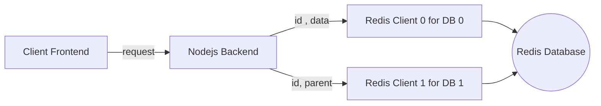

# Simple Nodejs+Redis Service

## Getting started
- Clone the repository
```
git clone https://github.com/ehsanmir/Simple-Service-in-Nodejs-and-Redis.git
```
- Install the service
```
cd Simple-Service-in-Nodejs-and-Redis
npm install
```
- Run and test the project
```
npm start
```
Navigate to `http://localhost:8080/dataService`

You also need redis database running on port 6379 and at least one sample key (like 0) in db0.

## Sample requests

|method|Input Example|Output Example|
|------|-------------|--------------|
|POST|`{"id":"123", "data":"sad user", "parent":"0"}`|`{"statusCode": "201", "message":"[*] Data successfully added."}`|
|GET|`/dataService?id=123`|`{"id":"123", "data":"sample user", "parent":"0"}`|
|PUT|`{"id":"123", "data":"happy user", "parent":"0"}`|`{"statusCode": "201", "message":"[*] Data successfully updated."}`|


## UML


## My development environment
- JDK v11.0.16
- JRE v11.0.16
- Nodejs v19.0.0
- NVM v0.39.2
- Git v2.34.1
- Redis v6.0.16
- Visual studio code v1.72.2

## Author
- email: ehsanmiir@gmail.com
- github: [Ehsan Mir](https://github.com/ehsanmir)
